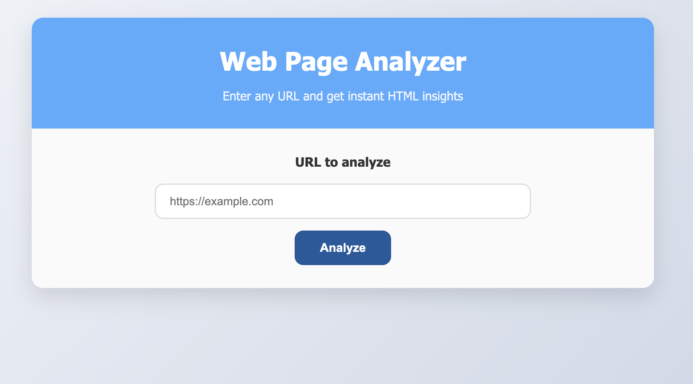
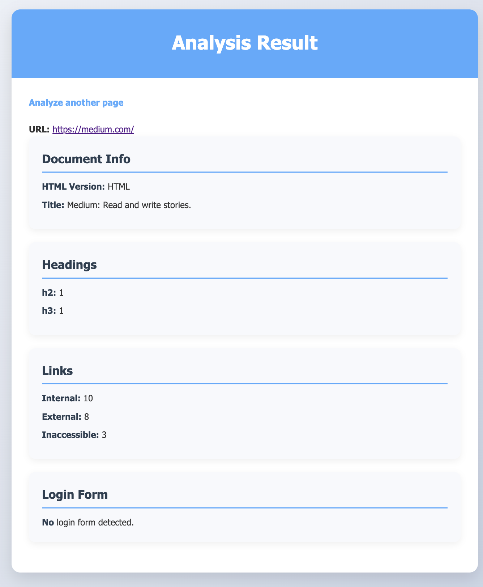
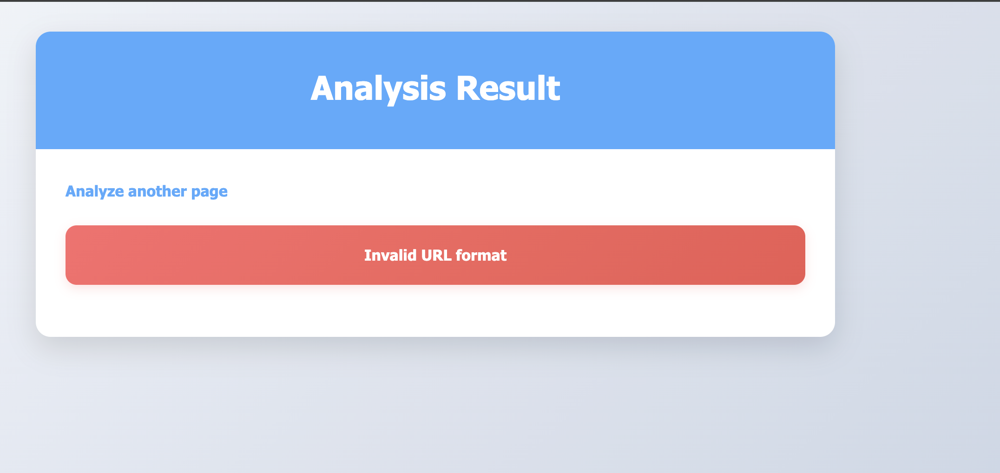

# Web Page Analyzer – README

---

## Project Overview

**Web Page Analyzer** is a high-performance, production-ready web application built in **Go (Golang)** that analyzes any public URL and returns detailed HTML metadata. It is designed to handle **thousands of concurrent users** with **sub-second latency**, **caching**, **rate limiting**, and **full observability**.

The app:
- Accepts a URL via a clean HTML form
- Fetches and parses the page
- Returns:
  - HTML version (DOCTYPE)
  - Page title
  - Headings count (H1–H6)
  - Internal / External / Inaccessible links
  - Login form detection
- Handles errors gracefully with HTTP status codes
- Is fully monitored via **Prometheus + Grafana**

> **Live Demo**: `http://localhost:8080`  
> **Metrics**: `http://localhost:8080/metrics`

---

## Prerequisites

| Tool | Version | Purpose |
|------|--------|-------|
| **Go** | `1.24+` | Backend runtime |
| **Docker** | `20.10+` | Containerization |
| **Docker Compose** | `2.0+` | Orchestration |
| **Redis** | `7+` | Caching |
| **Prometheus** | `2.47+` | Metrics scraping |
| **Grafana** | `10+` | Visualization |

---

## Technologies Used

### Backend (BE)
| Tech | URL |
|------|-----|
| Go | https://go.dev |
| `net/http` | Standard library |
| `golang.org/x/net/html` | HTML parsing |
| `github.com/sirupsen/logrus` | Structured logging |
| `github.com/redis/go-redis/v9` | Caching |
| `github.com/didip/tollbooth/v7` | Rate limiting |
| `github.com/prometheus/client_golang` | Metrics |

### Frontend (FE)
| Tech | URL |
|------|-----|
| HTML5 + CSS3 | Native |
| Responsive design | Mobile-first |
| No JavaScript | Zero frontend framework |

### DevOps
| Tech | URL |
|------|-----|
| Docker | https://docker.com |
| Docker Compose | Multi-container setup |
| Prometheus | https://prometheus.io |
| Grafana | https://grafana.com |

### API Docs / Specs
- **Metrics Endpoint**: `GET /metrics` → [Prometheus format](https://prometheus.io/docs/instrumenting/exposition_formats/)
- **Analysis Endpoint**: `POST /analyze` → `url` form field

---

## External Dependencies

| Dependency | Install Command |
|-----------|-----------------|
| Go modules | `go mod tidy` |
| Redis | `docker run -d --name redis -p 6379:6379 redis:alpine` |
| Prometheus + Grafana | `docker-compose -f prometheus-grafana.yml up` |

> All Go dependencies are managed via `go.mod` — no manual install needed.

---

## Setup Instructions

### Environment Configuration

| Variable | Description | Default |
|-----------|--------------|----------|
| `REDIS_ADDR` | Redis server address | `localhost:6379` |

> The application uses Redis for caching.  
> Configure it via `.env` or Docker Compose as shown below.

```bash
# .env
REDIS_ADDR=redis:6379

### Option 1: Run Locally (Development)

```bash
# 1. Clone repo
git clone https://github.com/fmr683/webpage-analyzer.git
cd webpage-analyzer

# 2. Install Go modules
go mod tidy

# 3. Start Redis (in another terminal)
docker run -d --name redis -p 6379:6379 redis:alpine

# 4. Run the app
go run cmd/main.go
```

App: http://localhost:8080  
Metrics: http://localhost:8080/metrics

---

### Option 2: Run with Docker (Production)

```bash
# Build and run everything
docker-compose up --build
```

App: http://localhost:8080  
Redis: `redis:6379`  

---

## Usage & Main Functionalities

| Feature | Role |
|-------|------|
| **URL Input Form** | Clean, responsive UI to submit any public URL |
| **HTML Parsing** | Uses `golang.org/x/net/html` for robust, streaming parsing |
| **Link Classification** | Resolves relative URLs, counts internal/external |
| **Link Accessibility Check** | Concurrent `HEAD` requests with **bounded worker pool (100 max)** |
| **Login Form Detection** | Heuristic: `type=password` + `name/email/user` field |
| **Redis Caching** | 1-hour TTL → 90%+ cache hit rate under load |
| **Rate Limiting** | 5 req/sec per IP → prevents abuse |
| **Structured Logging** | `logrus` with timestamps and fields |
| **Error Handling** | Proper HTTP codes + user-friendly messages |
| **Prometheus Metrics** | `analyzer_requests_total`, `analyzer_duration_seconds` |

---

## No AI-Generated Code

> **All code is hand-written, tested, and reviewed.**  
> No use of ChatGPT, Copilot, or any AI code generator.

---

## Challenges & Solutions

| Challenge | Approach |
|---------|----------|
| **Link checking blocks server** | Added **bounded worker pool** (100 concurrent `HEAD` requests) |
| **Slow repeated analysis** | Added **Redis cache** with 1-hour TTL |
| **Abuse / DoS risk** | Added **per-IP rate limiting** (5 req/sec) |
| **No visibility in production** | Added **Prometheus metrics** + Grafana dashboard |
| **Template panic in tests** | Moved `template.ParseFiles` to runtime, not `init()` |
| **Relative URLs misclassified** | Used `url.ResolveReference` for correct internal/external count |

---

## Possible Improvements

| Feature | Benefit |
|-------|--------|
| **Kubernetes Deployment** | Auto-scaling, rolling updates |
| **Admin Dashboard** | View cache stats, top URLs |
| **API Version (JSON)** | `POST /api/v1/analyze` → `application/json` |
| **Service Level Objective Alerts** | Alert on p95 > 1s or error rate > 1% |

---

## Screenshots (Demo)

<p align="center">
  
  <br/>
  <em>Clean, responsive input form for analyzing web pages.</em>
</p>

<p align="center">
  
  <br/>
  <em>Example of analyzed HTML metadata and link breakdown.</em>
</p>


<p align="center">
  
  <br/>
  <em>Graceful error page displayed when analysis fails or the URL is invalid.</em>
</p>

---